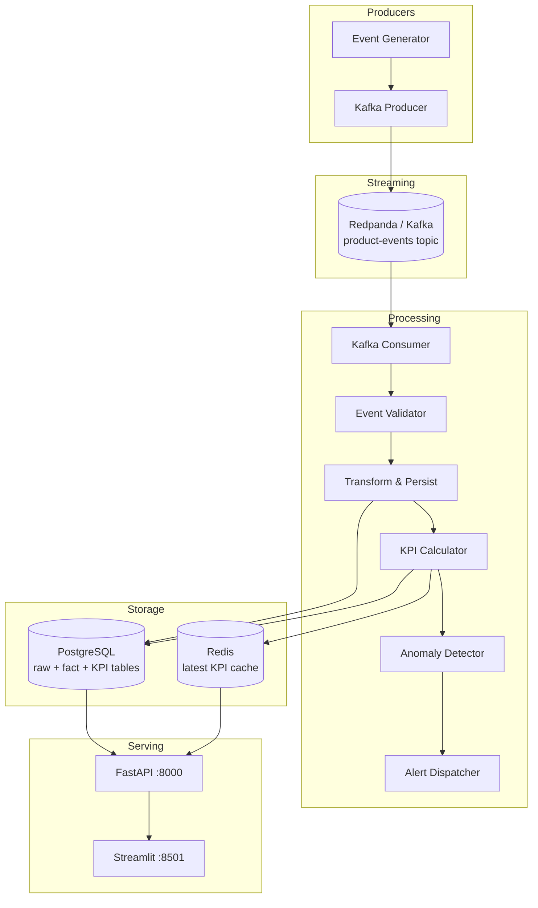

# Realtime Analytics Pipeline

[](https://github.com/parikhrjt/realtime-analytics-pipeline/actions/workflows/ci.yml)
[](https://www.python.org/downloads/)
[](LICENSE)

A production-grade realtime product analytics pipeline that ingests product events through Kafka-compatible streaming, validates and transforms them into PostgreSQL, caches KPI snapshots in Redis, and exposes metrics through FastAPI and a Streamlit dashboard.

Built as a senior data engineering portfolio project demonstrating event-driven architecture, stream processing, dimensional modeling, anomaly detection, and operational alerting.

> **Live demo:** Full stack runs via Docker Compose locally. Deploy the API on [Render](#cloud-deployment) and UI on [Streamlit Cloud](#deploy-ui-on-streamlit-cloud). See the [Demo walkthrough](#demo) below.

---

## Problem Statement

Product teams generate high-volume behavioral events — signups, page views, purchases, churn, and referrals — that must be processed in near realtime to power dashboards, KPI monitoring, and automated alerts.

This pipeline solves that by:

1. **Producing** realistic product events at configurable throughput
2. **Streaming** events through Redpanda (Kafka-compatible) for durable, decoupled ingestion
3. **Consuming** and validating events with strict schema rules
4. **Persisting** raw events plus denormalized fact tables in PostgreSQL
5. **Computing** daily KPIs (DAU, revenue, conversion, churn, referrals)
6. **Caching** latest KPI snapshots in Redis for sub-millisecond reads
7. **Detecting** anomalies when revenue or active users drop unexpectedly
8. **Alerting** via console output and optional Slack webhook simulation

---

## Features

| Capability | Details |
|---|---|
| **Event types** | `user_signup`, `page_view`, `purchase`, `subscription_cancelled`, `referral_created` |
| **Stream layer** | Redpanda / Kafka with keyed partitioning by `user_id` |
| **Validation** | Pydantic v2 schemas with per-event payload rules |
| **Storage** | Raw JSONB events + typed fact tables + KPI snapshots |
| **Cache** | Redis TTL cache for latest KPI bundle |
| **KPI engine** | DAU, revenue, conversion rate, churn rate, referral performance |
| **Anomaly detection** | Rolling-average drop detection (configurable threshold) |
| **Alerts** | Console banners + mock Slack webhook POST |
| **API** | FastAPI — `/health`, `/events`, `/kpis` |
| **Dashboard** | Streamlit with metric cards, trend charts, recent events |
| **Observability** | Structured logging (structlog), health checks |
| **Infrastructure** | Docker Compose full stack |
| **CI** | GitHub Actions — ruff + pytest |
| **Deployment** | Docker Compose · Render · Railway · Streamlit Cloud |

---

## Architecture



### Data Flow

```
Produce:  generator → validate → Kafka topic (key=user_id)
Consume:  Kafka → validate → raw_events + fact table → KPI refresh → Redis cache
Serve:    API reads Redis (fast path) or PostgreSQL (fallback) → Streamlit dashboard
Alert:    anomaly scan → console + Slack webhook on threshold breach
```

---

## Why Kafka, Redis, and PostgreSQL?

| Technology | Role | Why |
|---|---|---|
| **Redpanda/Kafka** | Event bus | Decouples producers from consumers; handles burst traffic; replayable log for reprocessing |
| **PostgreSQL** | System of record | ACID guarantees for raw events and KPI history; rich SQL for analytics; JSONB for flexible payloads |
| **Redis** | Hot cache | Sub-ms reads for dashboard/API; TTL-based freshness; offloads PostgreSQL for read-heavy KPI endpoints |

Together they form a classic lambda-architecture pattern: Kafka for speed and durability at ingestion, PostgreSQL for correctness and historical queries, Redis for serving latency-sensitive reads.

---

## Project Structure

```
realtime-analytics-pipeline/
├── app/
│   ├── api/              # FastAPI routes and schemas
│   ├── alerts/           # Console and Slack alert channels
│   ├── analytics/        # KPI calculator and anomaly detector
│   ├── consumer/         # Kafka consumer and event processor
│   ├── core/             # Config, logging, exceptions
│   ├── events/           # Event models, validator, producer
│   ├── storage/          # PostgreSQL and Redis clients
│   └── ui/               # Streamlit dashboard
├── sql/migrations/       # PostgreSQL schema migrations
├── scripts/              # Producer, consumer, migrate, API startup
├── tests/                # Unit tests (pytest)
├── docker-compose.yml
├── Dockerfile
├── Dockerfile.streamlit
├── streamlit_app.py
├── requirements.txt
├── pyproject.toml
└── .env.example
```

---

## Demo

Try the API in under 2 minutes after `docker compose up -d` (wait ~60s for events to flow).

```bash
export API_URL=http://localhost:8000
```

### Step 1 — Health check

```bash
curl -s "$API_URL/health" | python3 -m json.tool
```

### Step 2 — Recent events

```bash
curl -s "$API_URL/events?limit=5" | python3 -m json.tool
```

### Step 3 — Latest KPIs

```bash
curl -s "$API_URL/kpis?days=7" | python3 -m json.tool
```

Expected: `latest` object with `dau`, `revenue`, `conversion_rate`, `churn_rate`, `referral_performance` plus `history` arrays.

### Step 4 — Filter by event type

```bash
curl -s "$API_URL/events?event_type=purchase&limit=3" | python3 -m json.tool
```

### One-liner smoke test

```bash
API_URL=http://localhost:8000 \
  curl -sf "$API_URL/health" && \
  curl -sf "$API_URL/kpis" && \
  curl -sf "$API_URL/events?limit=1" && \
  echo "✓ All endpoints OK"
```

Open http://localhost:8501 for the live dashboard with metric cards and trend charts.

---

## Cloud Deployment

The **full streaming stack** (Redpanda + consumer + producer) is designed for Docker Compose or a VPS. For portfolio demos, deploy the **read API** to the cloud and the **UI** to Streamlit Cloud.

### Deploy API on Render

1. Connect repo at [render.com](https://render.com) → uses `render.yaml`
2. Add managed **PostgreSQL** and **Redis** (or external URLs)
3. Set `DATABASE_URL`, `REDIS_HOST`, `KAFKA_BOOTSTRAP_SERVERS` in dashboard
4. See [`.env.cloud.example`](.env.cloud.example)

### Deploy UI on Streamlit Cloud

1. [share.streamlit.io](https://share.streamlit.io) → repo → main file: `streamlit_app.py`
2. Secrets:

```toml
API_BASE_URL = "https://your-api.onrender.com"
```

### Local full stack (recommended for demos)

```bash
cp .env.example .env && docker compose up --build -d
```

---

## Quick Start (Docker Compose)

### Prerequisites

- Docker and Docker Compose
- 4 GB+ available RAM (Redpanda + PostgreSQL)

### Run the full stack

```bash
cd realtime-analytics-pipeline
cp .env.example .env
docker compose up --build -d
```

Services:

| Service | URL | Description |
|---|---|---|
| API | http://localhost:8000 | FastAPI REST endpoints |
| Dashboard | http://localhost:8501 | Streamlit KPI dashboard |
| Redpanda | localhost:19092 | Kafka-compatible broker (external) |
| PostgreSQL | localhost:5433 | Analytics database |
| Redis | localhost:6379 | KPI cache |

Wait ~60 seconds for migrations, consumer, and producer to start generating data.

### Verify

```bash
# Health check
curl -s http://localhost:8000/health | python3 -m json.tool

# Latest KPIs
curl -s http://localhost:8000/kpis | python3 -m json.tool

# Recent events
curl -s "http://localhost:8000/events?limit=5" | python3 -m json.tool
```

Open http://localhost:8501 for the dashboard.

### Stop

```bash
docker compose down -v
```

---

## Local Development (without Docker)

### Prerequisites

- Python 3.11+
- Running Redpanda/Kafka, PostgreSQL, and Redis (or use Docker for infra only)

### Setup

```bash
python3.11 -m venv .venv
source .venv/bin/activate
pip install -r requirements.txt
cp .env.example .env
python scripts/migrate.py
```

Start infrastructure only:

```bash
docker compose up -d redpanda db redis migrate
```

Run services in separate terminals:

```bash
make run-api        # FastAPI on :8000
make run-consumer   # Kafka consumer
make run-producer   # Event generator
make run-ui         # Streamlit on :8501
```

### Tests

```bash
make test
# or
pytest tests/ -v
```

Tests use mocked PostgreSQL and Redis — no external services required.

---

## API Reference

### `GET /health`

Returns service health and component status (PostgreSQL, Redis).

### `GET /events`

Query parameters:

| Param | Type | Default | Description |
|---|---|---|---|
| `limit` | int | 50 | Max events (1–500) |
| `event_type` | string | — | Filter by event type |

### `GET /kpis`

Query parameters:

| Param | Type | Default | Description |
|---|---|---|---|
| `days` | int | 7 | History window (1–90) |

Returns latest metric snapshots plus per-metric history. Reads from Redis when available, falls back to PostgreSQL.

---

## KPI Definitions

| Metric | Formula |
|---|---|
| **DAU** | Distinct `user_id` in `page_views` per day |
| **Revenue** | Sum of `amount` in `purchases` per day |
| **Conversion Rate** | Distinct purchasers ÷ distinct page viewers × 100 |
| **Churn Rate** | Cancellations ÷ active user base × 100 |
| **Referral Performance** | Referrals created ÷ signups × 100 |

---

## Anomaly Detection

The pipeline monitors **DAU** and **revenue** for day-over-day drops against a rolling average (default: 7-day lookback). When the drop exceeds the configured threshold (default: 30%), it:

1. Persists an anomaly record to PostgreSQL
2. Prints a console alert banner
3. POSTs to `SLACK_WEBHOOK_URL` if configured (skipped gracefully when empty)

Configure via `.env`:

```bash
ANOMALY_LOOKBACK_DAYS=7
ANOMALY_DROP_THRESHOLD_PCT=30.0
ANOMALY_ENABLED=true
SLACK_WEBHOOK_URL=https://hooks.slack.com/services/XXX/YYY/ZZZ
```

---

## Environment Variables

See [`.env.example`](.env.example) for the full list. Key settings:

| Variable | Default | Description |
|---|---|---|
| `KAFKA_BOOTSTRAP_SERVERS` | `localhost:19092` | Redpanda/Kafka brokers |
| `KAFKA_TOPIC` | `product-events` | Event topic name |
| `DATABASE_URL` | (see `.env.example`) | PostgreSQL connection string |
| `REDIS_HOST` | `localhost` | Redis hostname |
| `PRODUCER_INTERVAL_SECONDS` | `1.0` | Event generation interval |
| `ANOMALY_DROP_THRESHOLD_PCT` | `30.0` | Alert threshold |

---

## Future Improvements

- **dbt transformation layer** — formalize SQL models for KPI tables
- **Exactly-once semantics** — idempotent consumer with dedup keys
- **Schema registry** — Avro/Protobuf for event contract enforcement
- **Grafana dashboards** — operational metrics alongside product KPIs
- **Multi-tenant topics** — per-product event namespaces
- **Flink/Spark streaming** — scale beyond single-consumer throughput

---

## License

MIT — see [LICENSE](LICENSE).
